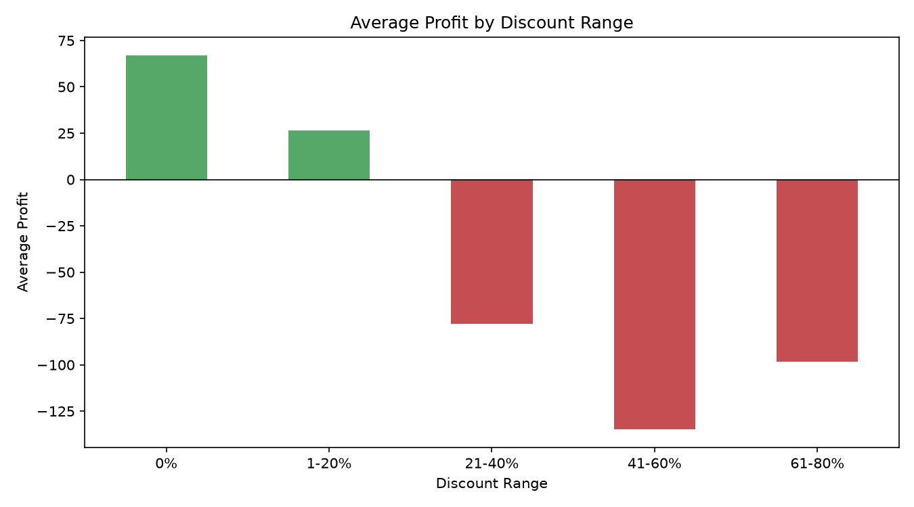
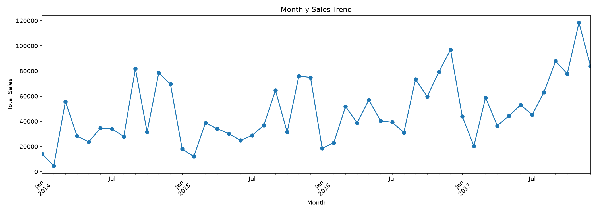
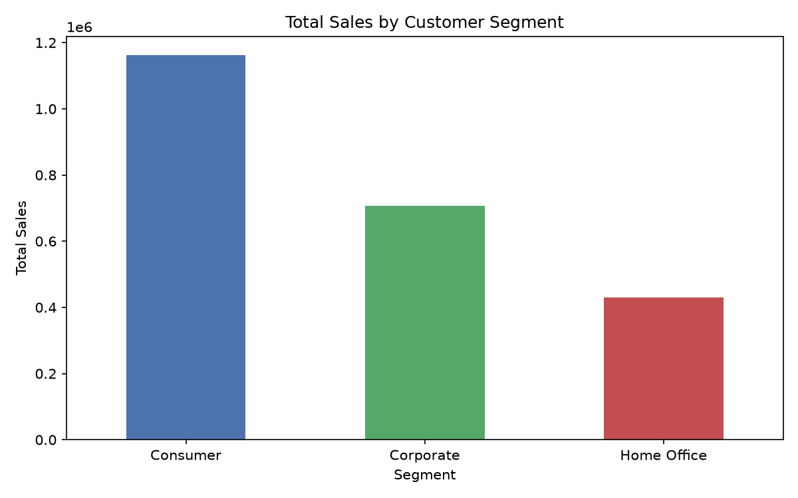
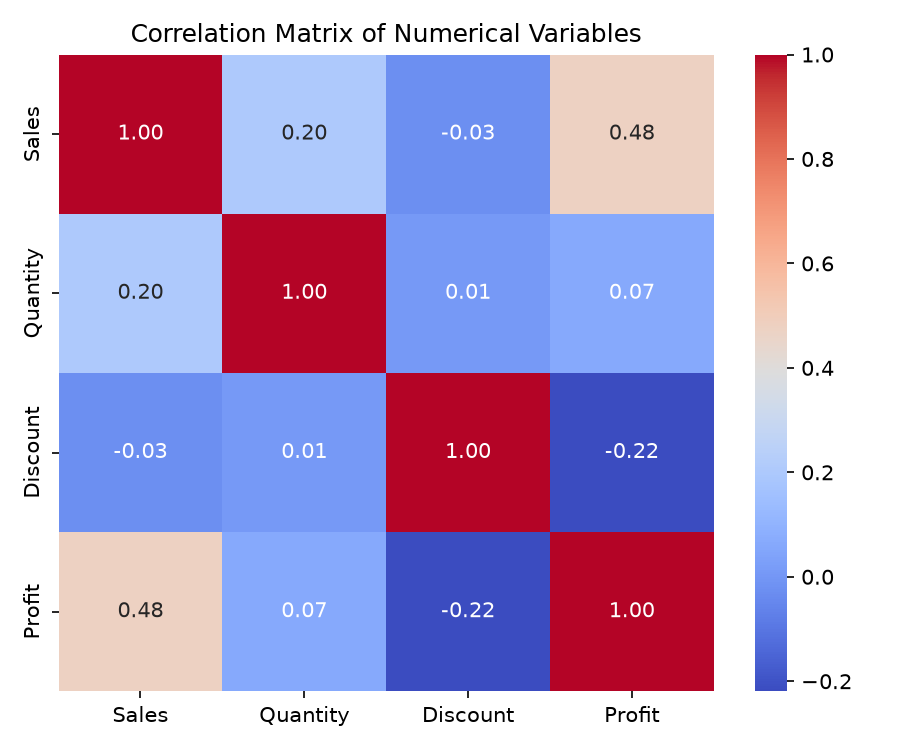
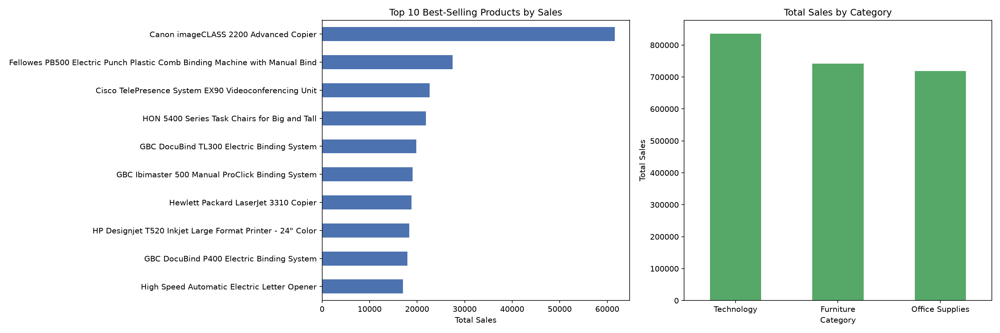

# Task 1 - Exploratory Data Analysis on Retail Sales Data

## Objective
Perform a thorough Exploratory Data Analysis (EDA) on a retail sales dataset to uncover patterns, customer behaviour trends, and actionable business insights.

## Dataset
[Sample Superstore Dataset](https://www.kaggle.com/datasets/vivek468/superstore-dataset-final) (Kaggle) — 9,994 orders with sales, profit, discount, customer segment, product category, and regional data across 2014-2017.

## Tools Used
Python, pandas, matplotlib, seaborn, Jupyter Notebook

## Key Findings

**1. Discounts above 20% turn orders unprofitable.**
Average profit is positive at 0% (~₹67) and 1-20% discount (~₹26), but flips negative from 21% onward — bottoming out around -₹135 at 41-60% discount. Discount policy above 20% needs review.

**2. Strong seasonal sales pattern with year-over-year growth.**
Sales dip every January-February and spike every November-December, with each year's peak exceeding the last (from ~₹82K in 2014 to ~₹119K in 2017).

**3. Consumer segment drives more than half of total sales.**
Consumer (~₹1.16M) outsells Corporate (~₹0.71M) and Home Office (~₹0.43M) combined, making it the priority segment for retention and marketing spend.

**4. Sales and Profit are correlated (0.48), but Discount is inversely related to Profit (-0.22).**

**5. The Canon imageCLASS 2200 Advanced Copier is the single top-selling product**, and binding/document-finishing machines dominate the top 10.

## Business Recommendations
1. Cap standard discounts at 20% — orders above this threshold consistently lose money.
2. Prioritize the Consumer segment in marketing while exploring growth strategies for Corporate/Home Office.
3. Prepare inventory and staffing ahead of the November-December seasonal peak, especially for top sellers like copiers and binding systems.

## Notebook
See [`Task1_EDA_Retail_Sales.ipynb`](Task1_EDA_Retail_Sales.ipynb) for the full analysis with code and detailed observations.