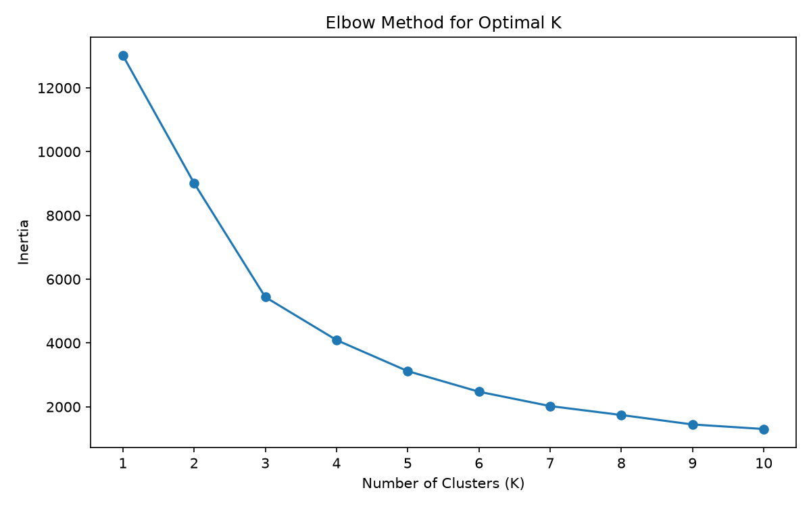
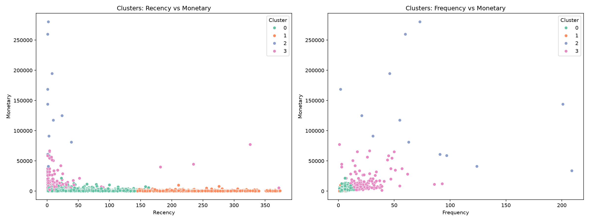
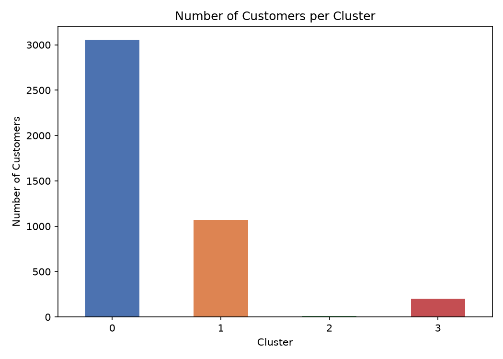

# Task 2 - Customer Segmentation Analysis

## Objective
Apply clustering algorithms to segment an e-commerce company's customer base into distinct groups based on purchasing behaviour, enabling targeted marketing strategies.

## Dataset
[Online Retail Dataset](https://www.kaggle.com/datasets/vijayuv/onlineretail) (UCI/Kaggle) — ~540,000 transactions from a UK-based online retailer, Dec 2010 - Dec 2011.

## Tools Used
Python, pandas, scikit-learn (KMeans), matplotlib, seaborn, Jupyter Notebook

## Approach
1. Cleaned the raw transaction data — removed rows missing CustomerID (~25%), cancelled orders, and invalid quantities/prices, leaving 397,884 valid transactions.
2. Engineered **RFM features** (Recency, Frequency, Monetary) for each of 4,338 unique customers.
3. Standardized features and used the **Elbow Method** to determine the optimal number of clusters (K=4).
4. Applied **K-Means clustering** and profiled each resulting segment.

## Key Findings

**Four distinct customer segments emerged:**

| Cluster | Recency (days) | Frequency | Avg. Monetary | Count | Segment |
|---|---|---|---|---|---|
| 0 | 43.7 | 3.68 | ₹1,359 | 3,054 | Regular Customers |
| 1 | 248.1 | 1.55 | ₹481 | 1,067 | At-Risk / Churned |
| 2 | 7.4 | 82.54 | ₹127,338 | 13 | VIP / Champions |
| 3 | 15.5 | 22.33 | ₹12,709 | 204 | Loyal High-Value |

## Business Recommendations
1. **Protect VIP customers (Cluster 2)** with dedicated account management — only 13 customers but by far the highest value per customer.
2. **Grow Loyal High-Value customers (Cluster 3)** toward VIP status with tiered loyalty rewards.
3. **Launch a win-back campaign for At-Risk customers (Cluster 1)** — nearly 25% of the customer base hasn't purchased in ~8 months.
4. **Maintain engagement with Regular Customers (Cluster 0)** through regular promotions to increase frequency over time.

## Notebook
See [`Task2_Customer_Segmentation.ipynb`](Task2_Customer_Segmentation.ipynb) for the full analysis with code and detailed observations.