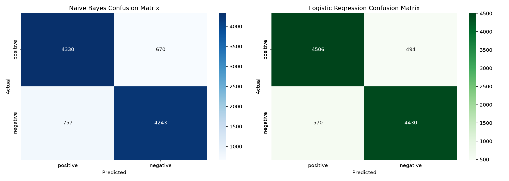

# Task 4 - Sentiment Analysis

## Objective
Build a machine learning model that classifies the sentiment of text data (positive or negative), providing insights into public opinion.

## Dataset
[IMDB Dataset of 50K Movie Reviews](https://www.kaggle.com/datasets/lakshmi25npathi/imdb-dataset-of-50k-movie-reviews) (Kaggle) — 50,000 movie reviews, perfectly balanced between positive and negative sentiment.

## Tools Used
Python, pandas, scikit-learn, NLTK, matplotlib, seaborn

## Approach
1. Cleaned raw review text: lowercased, removed HTML tags and punctuation, removed stopwords.
2. Converted text to numerical features using **TF-IDF** (top 5,000 features).
3. Split data 80/20 (train/test) with stratification.
4. Trained and compared two classifiers: **Multinomial Naive Bayes** and **Logistic Regression**.
5. Evaluated using accuracy, precision, recall, F1-score, and confusion matrices.
6. Performed error analysis on misclassified reviews.

## Key Findings

**Logistic Regression outperformed Naive Bayes on every metric:**

| Model | Accuracy | Precision | Recall | F1-Score |
|---|---|---|---|---|
| Naive Bayes | 85.7% | 85.1% | 86.6% | 85.9% |
| Logistic Regression | 89.4% | 88.8% | 90.1% | 89.4% |

**Error analysis** revealed that most misclassifications involved reviews with mixed sentiment, sarcasm, or emotionally-loaded vocabulary used in a neutral/plot-descriptive context — a known limitation of TF-IDF-based models, which treat words independently without understanding context or word order.

## Conclusion
Logistic Regression is the recommended model for this task, achieving 89.4% accuracy. In a real-world application, this could power automated review sentiment tracking for a streaming platform or review aggregator. More advanced approaches (word embeddings, transformer models like BERT) would likely improve handling of sarcasm and mixed sentiment.

## Notebook
See [`Task4_Sentiment_Analysis.ipynb`](Task4_Sentiment_Analysis.ipynb) for the full analysis with code and detailed observations.