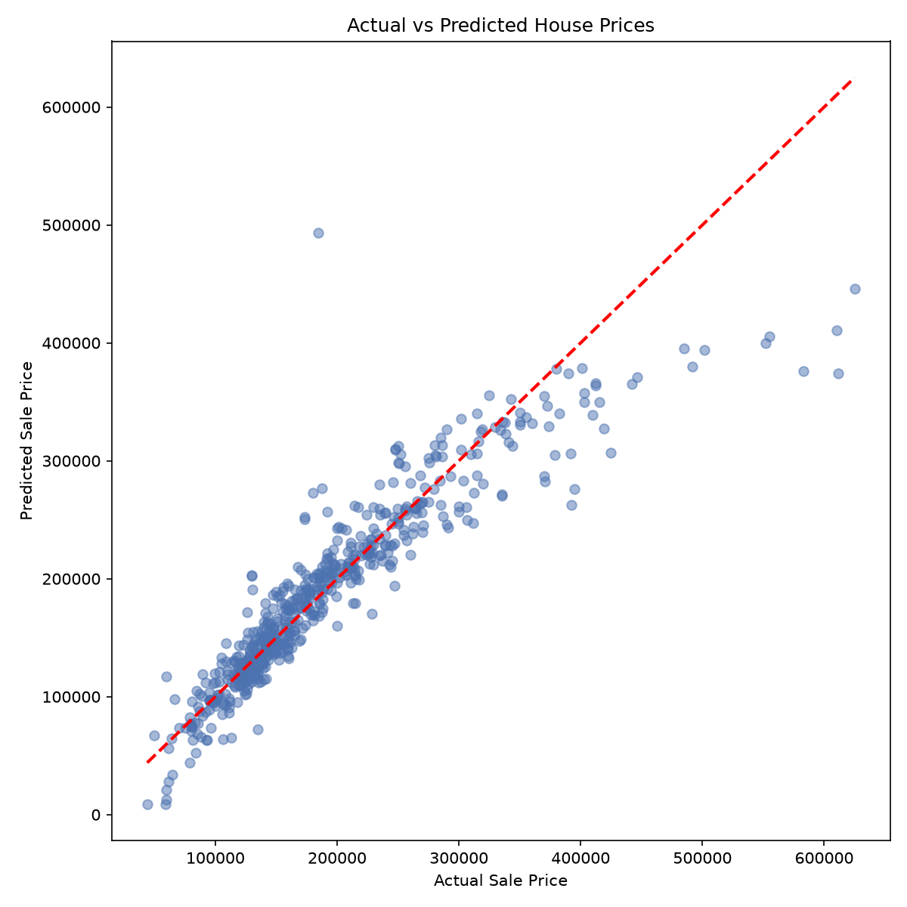
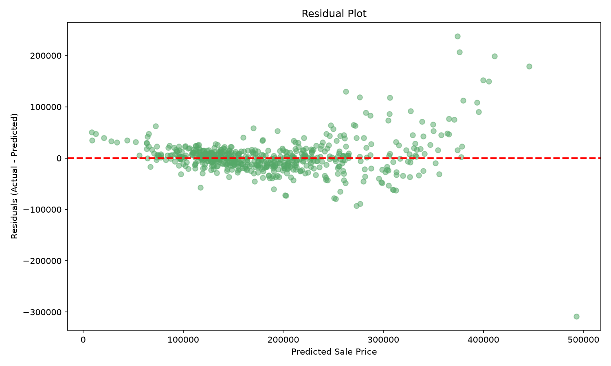

# Level 2 - Task 1: Predicting House Prices with Linear Regression

## Objective
Build and evaluate a linear regression model that predicts house prices based on features such as area, location, number of rooms, and age.

## Dataset
[Ames Housing Dataset](https://www.kaggle.com/datasets/shashanknecrothapa/ames-housing-dataset) (Kaggle) — 2,930 house sale records with ~80 features.

## Tools Used
Python, pandas, scikit-learn, matplotlib, seaborn

## Approach
1. Performed EDA including null checks and target variable (SalePrice) distribution analysis.
2. Deliberately selected 14 interpretable features (area, rooms, age, location, quality, garage) from 82 available columns.
3. Handled minor missing values and One-Hot Encoded the `Neighborhood` feature.
4. Built a correlation heatmap to identify top predictors.
5. Trained a Linear Regression model (80/20 train/test split) and evaluated with MSE, RMSE, and R².
6. Analyzed actual-vs-predicted scatter plot, residual plot, and feature coefficients.
7. Compared against a Ridge regularized model (bonus).

## Key Findings

**Model Performance:** R² = **0.8461**, RMSE = **~$35,123**

**Top predictors:** `Overall Qual` (quality rating) and `Gr Liv Area` (living space) showed the strongest correlation with price. **Neighborhood** had an outsized impact — premium neighborhoods like Green Hills add over $100,000 to a home's value independent of size or quality.

**Limitation identified:** The model systematically underpredicts high-value homes (>$400K), shown by both the scatter plot and a widening residual spread (heteroscedasticity) — indicating luxury homes have value drivers not fully captured by the current feature set.

**Bonus comparison:** Ridge Regression (R²=0.8449) performed marginally worse than plain Linear Regression, suggesting the deliberately selected, low-redundancy feature set already avoided major multicollinearity issues.

## Conclusion
A simple, interpretable 14-feature Linear Regression model explains ~85% of house price variation. Future improvements could include log-transforming SalePrice, adding quality-related features, or testing non-linear models for the luxury-home segment.

## Notebook
See [`L2Task1_House_Price_Prediction.ipynb`](L2Task1_House_Price_Prediction.ipynb) for the full analysis with code and detailed observations.