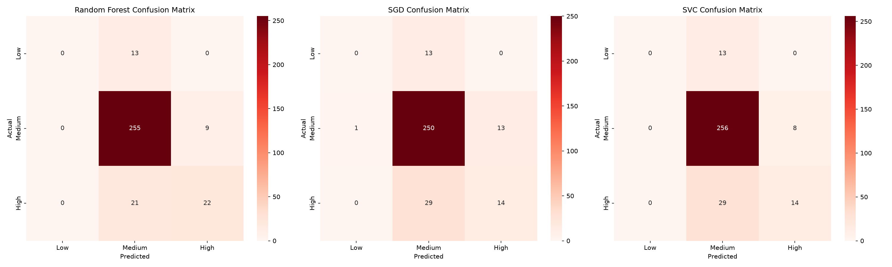
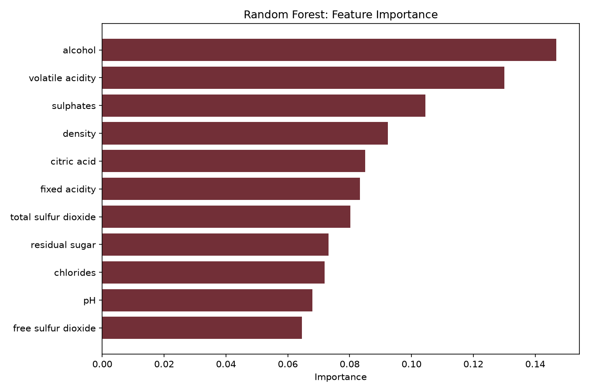

# Level 2 - Task 2: Wine Quality Prediction

## Objective
Train and compare multiple classification models to predict the quality score of wine based on its physicochemical properties.

## Dataset
[Red Wine Quality Dataset](https://www.kaggle.com/datasets/uciml/red-wine-quality-cortez-et-al-2009) (UCI/Kaggle, Cortez et al. 2009) — 1,599 red wine samples with 11 physicochemical features.

## Tools Used
Python, pandas, numpy, scikit-learn (Random Forest, SGD, SVC), seaborn, matplotlib

## Approach
1. Identified severe class imbalance in raw quality scores (3-8), with some classes having as few as 10 samples.
2. Binned quality scores into 3 classes (Low/Medium/High) to create a more learnable problem.
3. Performed EDA: feature distributions and correlation heatmap.
4. Stratified train/test split (80/20) and feature standardization.
5. Trained and compared **3 classifiers**: Random Forest, SGD, and SVC.
6. Evaluated with accuracy, classification reports, and confusion matrices.
7. Analyzed Random Forest feature importance.

## Key Findings

| Model | Accuracy | High F1 | Low F1 | Medium F1 |
|---|---|---|---|---|
| **Random Forest** | **86.6%** | **0.59** | 0.00 | 0.92 |
| SGD Classifier | 82.5% | 0.40 | 0.00 | 0.90 |
| SVC | 84.4% | 0.43 | 0.00 | 0.91 |

**Critical finding:** All three models completely fail to identify "Low" quality wines (0% F1-score) due to severe class imbalance (only 50 training examples). This demonstrates why overall accuracy can be a misleading metric on imbalanced data — 86% accuracy sounds strong, but the model is functionally blind to an entire class.

**Top predictive features:** `alcohol` and `volatile acidity`, consistent with their strongest correlations to quality in the EDA.

## Conclusion
**Random Forest is the recommended model** for its highest accuracy, best "High"-class performance, and built-in interpretability via feature importance. However, its complete failure on the "Low" class means class-imbalance handling (e.g. SMOTE, class weighting) would be required before real-world deployment.

## Notebook
See [`L2Task2_Wine_Quality_Prediction.ipynb`](L2Task2_Wine_Quality_Prediction.ipynb) for the full analysis with code and detailed observations.