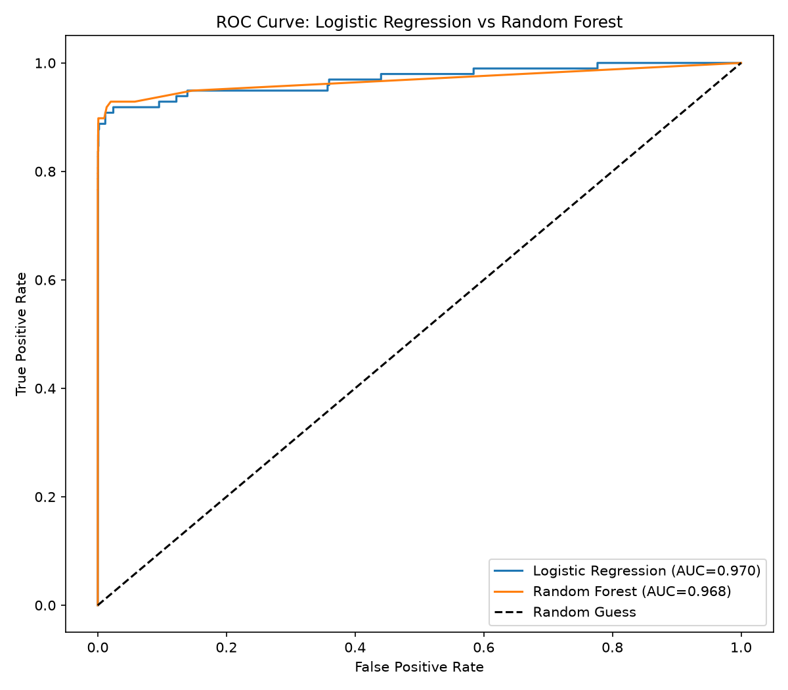
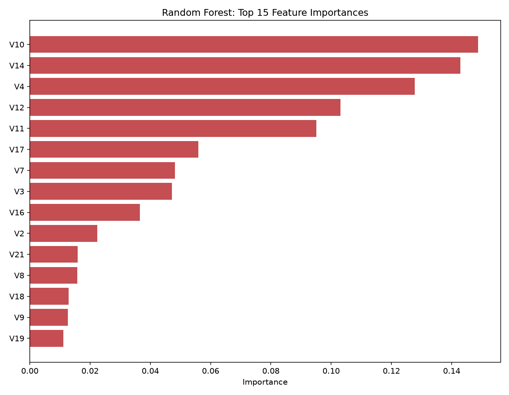

# Level 2 - Task 3: Fraud Detection

## Objective
Build a machine learning pipeline to detect fraudulent financial transactions from a heavily imbalanced dataset, addressing class imbalance as a core challenge.

## Dataset
[Credit Card Fraud Detection Dataset](https://www.kaggle.com/datasets/mlg-ulb/creditcardfraud) (Kaggle, mlg-ulb) — 284,807 transactions, only 492 (0.173%) fraudulent. Features V1-V28 are PCA-transformed for confidentiality.

## Tools Used
Python, pandas, scikit-learn, imbalanced-learn (SMOTE), matplotlib, seaborn

## Approach
1. Confirmed severe class imbalance (0.173% fraud) and discussed why standard accuracy is a misleading metric here.
2. EDA on transaction amount and time-of-day patterns for fraud vs. genuine transactions.
3. Stratified train/test split, then applied **SMOTE** to the training set only (never the test set) to balance classes.
4. Trained and compared **2 models**: Logistic Regression and Random Forest.
5. Evaluated using Precision, Recall, F1-Score, and AUC-ROC — not accuracy.
6. Analyzed feature importance and discussed scalability to 1M transactions/hour.

## Key Findings

| Model | Precision | Recall | F1-Score | AUC-ROC |
|---|---|---|---|---|
| Logistic Regression | 0.056 | 0.918 | 0.105 | 0.970 |
| **Random Forest** | **0.853** | 0.827 | **0.839** | 0.968 |

**Critical finding:** Both models show nearly identical AUC-ROC (~0.97), but a massive real-world difference in usability. Logistic Regression's high recall (92%) comes at the cost of extremely poor precision (5.6%) — it would flag ~16 false alarms for every real fraud caught, making it operationally impractical. Random Forest offers a far more usable balance (85% precision, 83% recall).

**Discussion:** With standard accuracy would show 99.8%+ for a trivial "always predict genuine" model, this task demonstrates why multiple complementary metrics are essential for imbalanced classification problems.

## Conclusion
**Random Forest is the recommended model** for its practical precision/recall balance. Scaling to 1M transactions/hour would require infrastructure beyond the model itself — distributed serving, streaming feature computation, and continuous retraining to handle evolving fraud patterns (concept drift).

## Notebook
See [`L2Task3_Fraud_Detection.ipynb`](L2Task3_Fraud_Detection.ipynb) for the full analysis with code and detailed observations.