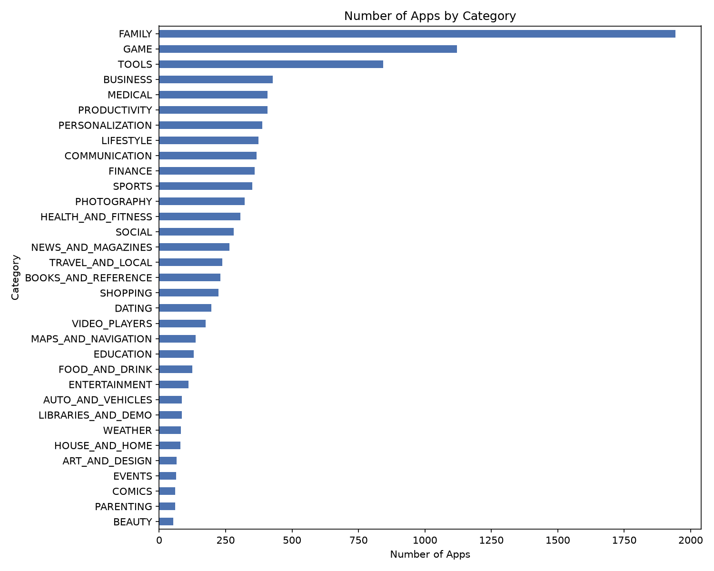
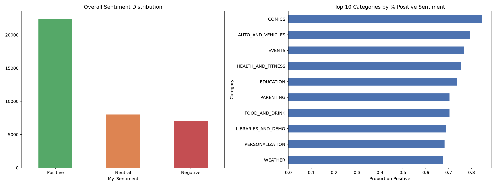

# Level 2 - Task 4: Unveiling the Android App Market (Google Play Store Analysis)

## Objective
Perform a comprehensive data analysis of the Google Play Store ecosystem — cleaning messy real-world data, exploring app categories, analysing ratings and pricing trends, and conducting sentiment analysis on user reviews.

## Dataset
[Google Play Store Apps](https://www.kaggle.com/datasets/lava18/google-play-store-apps) (Kaggle, lava18) — 10,841 apps + 64,295 user reviews.

## Tools Used
Python, pandas, numpy, matplotlib, seaborn, TextBlob, plotly

## Approach
1. Cleaned messy real-world data: removed 484 duplicate/invalid rows, fixed incorrect data types (`Installs`, `Price`, `Size`, `Reviews` stored as text).
2. Analyzed app category distribution, ratings, size-vs-installs correlation, and pricing patterns.
3. Performed independent sentiment analysis on 37,427 user reviews using TextBlob, validated against the dataset's pre-labeled sentiment (**92.4% agreement**).
4. Analyzed sentiment by app category.
5. Built both static and interactive (plotly) visualizations.

## Key Findings

**Category saturation:** FAMILY (1,943 apps) and GAME (1,121 apps) are by far the most saturated categories.

**Pricing:** 92.6% of apps are free; among paid apps, most are priced under $10.

**Sentiment:** 59.9% of reviews are Positive, 21.4% Neutral, 18.7% Negative — validated at 92.4% agreement with the dataset's own pre-labeled sentiment.

**Non-obvious insight:** App size and rating showed weak/no correlation with install count (r=0.169) — highly-rated, low-install niche apps exist alongside massive low-rated hits, showing popularity isn't purely rating-driven.

## Conclusion: 3 Insights for a Developer Launching a New App
1. Avoid oversaturated categories (FAMILY, GAME) unless offering a strong differentiator.
2. App size doesn't meaningfully drive installs — prioritize marketing and ASO over minimizing file size.
3. The free-with-monetization model dominates (92.6%); if going paid, price competitively under $10.

## Notebook
See [`L2Task4_Google_Play_Store_Analysis.ipynb`](L2Task4_Google_Play_Store_Analysis.ipynb) for the full analysis with code and detailed observations.