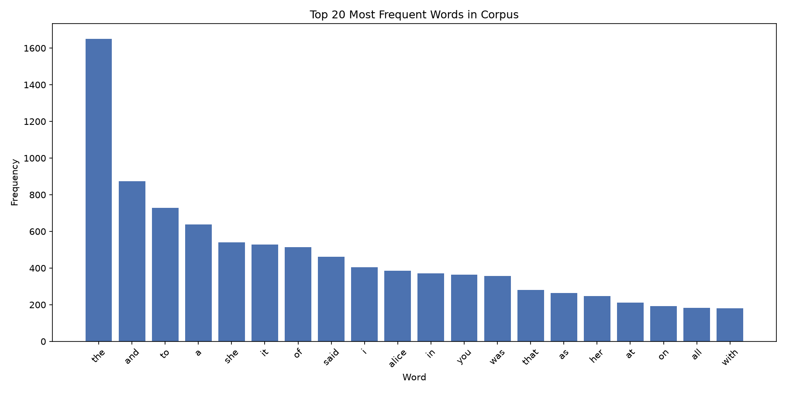
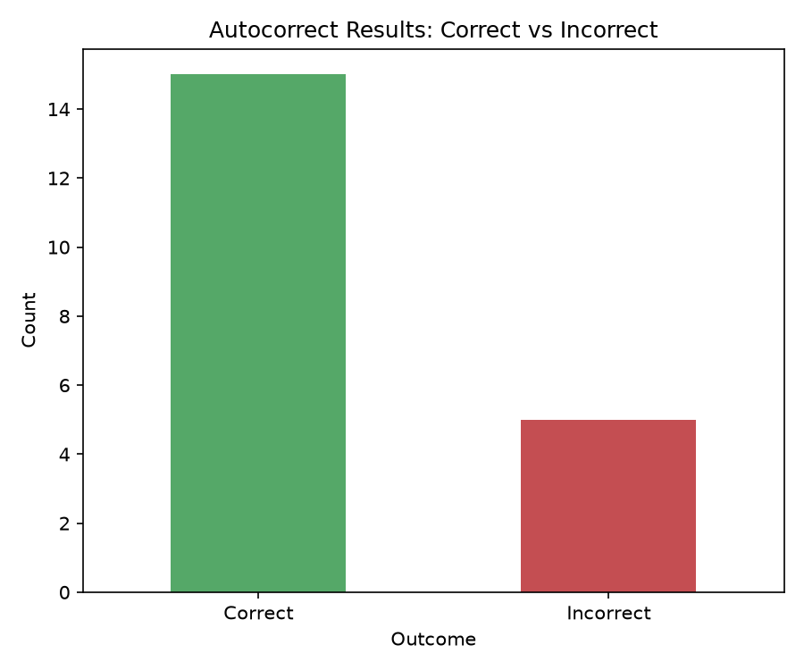

# Task 5 - Autocomplete and Autocorrect Data Analytics

## Objective
Analyse the efficiency and accuracy of autocomplete and autocorrect algorithms using NLP techniques. Implement and compare multiple approaches for text prediction and spelling correction on a real text dataset.

## Dataset
[Alice's Adventures in Wonderland](https://www.gutenberg.org/ebooks/11) by Lewis Carroll (Project Gutenberg) — used as a text corpus (~27,000 tokens, 2,672 unique words).

## Tools Used
Python, NLTK, pyspellchecker, pandas, matplotlib, collections

## Approach

**Autocomplete:** Built bigram and trigram frequency models from the corpus. Predictions try the trigram model first (last 2 words of context) and fall back to bigram if the trigram prefix is unseen. Tested on 10 prefixes with top-3 predictions each.

**Autocorrect:** Used `pyspellchecker` (edit-distance + word frequency) loaded with the book's own vocabulary. Tested on 20 deliberately misspelled words against known ground truth.

**Algorithm comparison:** Compared context-aware (n-gram) autocomplete against a context-free (frequency-only) baseline to demonstrate the value of sequence context.

## Key Findings

**Autocomplete:** Produces contextually sensible, book-specific predictions (e.g. "down the" → "rabbit", "chimney"). The context-free baseline returns the same generic words ("the", "and", "to") regardless of input, confirming that context genuinely improves prediction quality.

**Autocorrect: 75% accuracy (15/20)** on the test set.

**Error analysis** showed that autocorrect errors consistently occurred when a common English word was equally or more edit-distance-close than the correct, less-common book-specific word (e.g. character names) — a known limitation of frequency-weighted edit-distance correction.

## Conclusion
This project demonstrates the core building blocks (n-gram modeling, edit-distance correction) underlying production autocomplete/autocorrect systems. Compared to systems like Google Keyboard, this implementation is limited by corpus size, lack of personalization, shorter context window, and simpler correction signals — see the notebook's conclusion for full discussion.

## Notebook
See [`Task5_Autocomplete_Autocorrect.ipynb`](Task5_Autocomplete_Autocorrect.ipynb) for the full analysis with code and detailed observations.